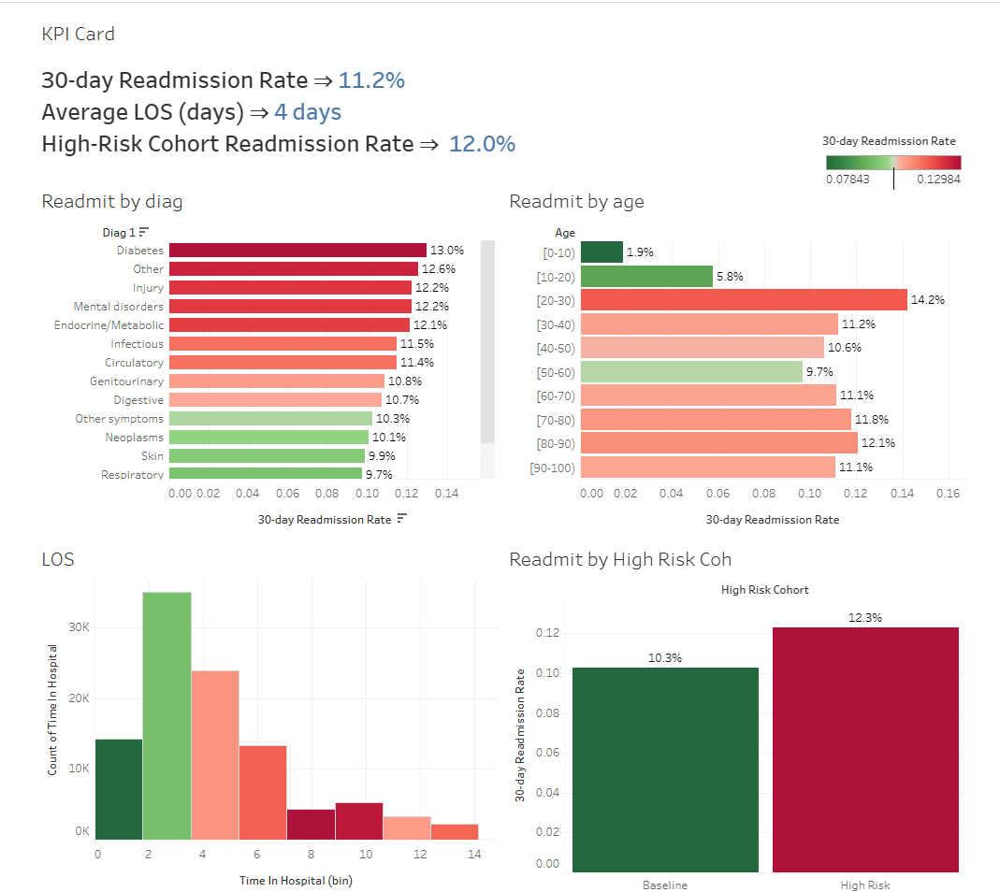

# Hospital-Readmission---LOS-Analysis
Healthcare Analysis

## Project Overview

This project analyzes hospital readmissions using the Diabetes 130-US Hospitals dataset (1999–2008). The objective is to identify key factors driving readmissions and visualize insights for hospital management.

## Dataset

- Source: Kaggle – [Diabetes 130-US Hospitals](https://www.kaggle.com/datasets/brandao/diabetes?utm_source=chatgpt.com)
- Size: 100k+ hospital encounters
- Key features: demographics, diagnoses (ICD9 codes), LOS, medications, readmission status

## Methodology
Data Cleaning

- Handled missing values (e.g., dropped weight >97% missing)
- Mapped ICD9 codes into clinical categories (Circulatory, Respiratory, Diabetes, etc.)
- Engineered target: 30-day readmission (binary)

Exploratory Data Analysis (EDA)

- Distribution of Length of Stay (LOS)
- Readmission by diagnosis & age groups
- Stratified analysis for high-risk cohorts

Modeling

- Logistic Regression & Random Forest (baseline models)
- Evaluated with ROC-AUC, PR-AUC, F1-score
- Identified key predictors: number of lab procedures, medications, LOS

Visualization (Tableau)

- KPI Dashboard: Readmission Rate, LOS, High-Risk Cohorts
- Readmission by Age / Diagnosis
- LOS distribution vs readmission
- High-Risk cohort comparison

## Key Findings

- Overall 30-day readmission rate: **11.2%**
- Diabetes & mental disorders → highest readmission risk (~13%)
- Younger trauma patients (20–30) had surprisingly high readmissions (14%)
- High-risk cohort (60+ with multiple diagnoses) → **12% vs 10% baseline**

## Dashboard
- Tableau Public Link: [Link](https://public.tableau.com/app/profile/yang.chen8410/viz/Dashboard_17578883593370/ExecutiveSummary)
- Sample Preview: 

## Tech Stack

- Python: pandas, numpy, matplotlib, seaborn, scikit-learn
- Visualization: Tableau
- Version Control: GitHub

##  Author

Yang Chen  
Data Analyst | Healthcare Analyst
[LinkedIn](https://www.linkedin.com/in/yang-chen-34a6401a1/)
